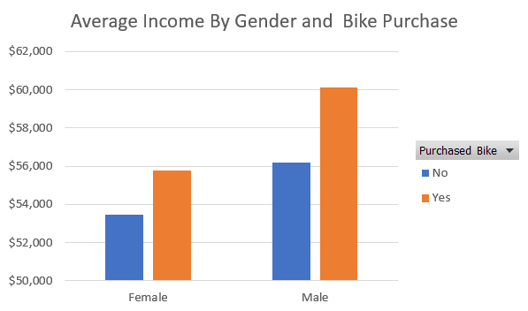
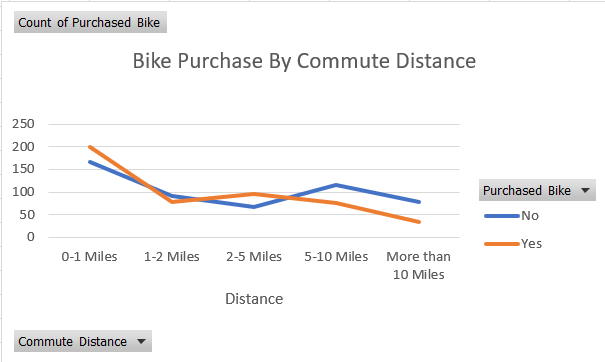
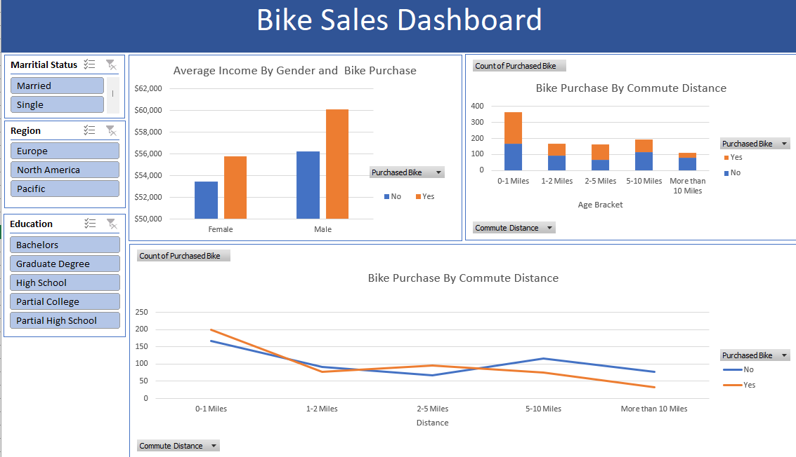

# 🚴 Bike Sales Dashboard

A dynamic Excel-based dashboard that visualizes customer bike-purchase behavior by demographic and commute-distance segments.

---

## 📝 Overview

This project explores a sample customer dataset to answer:
- **Who** is more likely to purchase a bike (by gender, income, education, marital status)?  
- **How** does commute distance and age affect bike-buying?

Interactive filters let you slice by Region, Education, and Marital Status.

---

## 📊 Dashboard Components

1. **Average Income by Gender & Purchase**  
   Compare average household income for buyers vs. non-buyers across genders.  
   

2. **Bike Purchase by Commute Distance & Age Bracket**  
   Stacked-column and line charts showing count of purchases (Yes/No) across distance buckets for different age groups.  
   

3. **Global Dashboard View**  
   Use slicers for Region, Education, and Marital Status to filter all charts.  
   

---

## 🔍 Key Insights

- **Gender & Income**  
  - Males who bought bikes have the highest average income (~$60k).  
  - Females show a similar pattern, but at ~$55k for buyers.

- **Commute Distance**  
  - Highest purchase rates occur in the 0–1 mile group.  
  - Purchase propensity declines steadily as commute distance increases, with few sales beyond 10 miles.

- **Demographic Filters**  
  - Married vs. single, and education level, all shift both count and income trends when applied.

---

## 📬 Contact

Chirag Pandey  
– ✉️ chiragpandey0504@gmail.com  
– GitHub: [@chiragpandey0504](https://github.com/chiragpandey0504)

